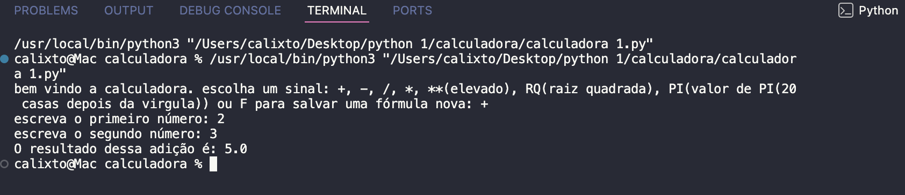

#  Calculadora Python

Uma calculadora desenvolvida em Python para realizar diferentes operações matemáticas pelo terminal.

O projeto permite realizar operações básicas, como adição, subtração, multiplicação e divisão, além de potenciação, raiz quadrada e consulta do valor de PI. Também possui uma opção para salvar fórmulas em um arquivo de texto.

---

##  Demonstração

O programa funciona diretamente pelo terminal.

Ao iniciar, o usuário escolhe a operação que deseja realizar.

Exemplo:

```text
bem vindo a calculadora. escolha um sinal: +, -, /, *, **(elevado), RQ(raiz quadrada), PI(valor de PI(20 casas depois da virgula)) ou F para salvar uma fórmula nova: +

escreva o primeiro número: 10
escreva o segundo número: 5

O resultado dessa adição é: 15.0
```

Outro exemplo utilizando potenciação:

```text
bem vindo a calculadora. escolha um sinal: +, -, /, *, **(elevado), RQ(raiz quadrada), PI(valor de PI(20 casas depois da virgula)) ou F para salvar uma fórmula nova: **

escreva o número a ser elevado: 2
escreva o expoente : 3

2.0 elevado a 3.0 é: 8.0
```

---

##  Pré-requisitos

Para executar o projeto, é necessário ter:

* Python 3 instalado;
* Um terminal;
* Git, caso o projeto seja clonado pelo GitHub.

O projeto utiliza a biblioteca `math`, que faz parte da biblioteca padrão do Python. Portanto, não é necessário instalar bibliotecas externas.

---

##  Instalação

### 1. Clone o repositório

```bash
git clone https://github.com/CALIXTO-Samuel/calculadora-python-b-sica.git
```

### 2. Entre na pasta do projeto

```bash
cd calculadora-python-b-sica
```

### 3. Execute a calculadora

```bash
python3 "calculadora 1.py"
```

Em alguns computadores, também pode ser utilizado:

```bash
python "calculadora 1.py"
```

---

##  Uso

Ao executar o programa, será apresentada uma mensagem solicitando que o usuário escolha uma operação.

As opções disponíveis são:

| Entrada | Operação           |
| :-----: | ------------------ |
|   `+`   | Adição             |
|   `-`   | Subtração          |
|   `*`   | Multiplicação      |
|   `/`   | Divisão            |
|   `**`  | Potenciação        |
|   `RQ`  | Raiz quadrada      |
|   `PI`  | Valor de PI        |
|   `F`   | Salvar uma fórmula |

### ➕ Adição

Digite `+` e informe os dois números:

```text
escreva o primeiro número: 10
escreva o segundo número: 7

O resultado dessa adição é: 17.0
```

### ➖ Subtração

Digite `-` e informe os dois números:

```text
escreva o primeiro número a ser subtraído: 10
escreva o segundo número: 4

O resultado dessa subtração é: 6.0
```

### ✖️ Multiplicação

Digite `*` e informe os dois números:

```text
escreva o primeiro número: 6
escreva o segundo número: 5

O resultado dessa multiplicacão é: 30.0
```

### ➗ Divisão

Digite `/` e informe os dois números:

```text
escreva o primeiro número a ser dividido: 10
escreva o segundo número: 3

O resultado dessa divisão é: 3.3333333333333335 resto: 1.0
```

### 🔢 Potenciação

Digite `**` e informe o número e o expoente:

```text
escreva o número a ser elevado: 2
escreva o expoente : 4

2.0 elevado a 4.0 é: 16.0
```

### √ Raiz quadrada

Digite `RQ` e informe o número:

```text
escreva o número que será encontrada sua raiz quadrada: 25

a Raiz de 25.0 é: 5.0
```

### π Valor de PI

Digite `PI` para visualizar o valor de PI:

```text
3.141592653589793
```

###  Salvar uma fórmula

Digite `F` para salvar uma fórmula em um arquivo de texto:

```text
Escreva a fórmula a ser salva: A = B + C
```

A fórmula será adicionada ao arquivo:

```text
formulas.txt
```

---

## 📸 Demonstração



##  Estrutura do Projeto

```text
calculadora-python-b-sica/
│
├── calculadora 1.py
├── formulas.txt
├── README.md
└── LICENSE
```

### Principais arquivos

**`calculadora 1.py`**

É o arquivo principal do projeto. Contém o código da calculadora e todas as operações disponíveis.

**`formulas.txt`**

Arquivo de texto utilizado para armazenar as fórmulas adicionadas através da opção `F`.

> Esse arquivo pode ser criado automaticamente quando uma fórmula é salva pela primeira vez.

**`README.md`**

Arquivo que apresenta a documentação do projeto, incluindo instalação, utilização e estrutura.

**`LICENSE`**

Arquivo que apresenta a licença utilizada no projeto.

---

##  Tecnologias utilizadas

*  Python 3
*  Biblioteca `math`
*  Git
*  GitHub

A biblioteca `math` é utilizada principalmente para calcular a raiz quadrada e acessar o valor de PI.

---

##  Objetivo do projeto

O objetivo do projeto é praticar conceitos básicos de programação em Python através da criação de uma calculadora funcional.

O projeto utiliza conceitos como:

* Variáveis;
* Entrada de dados com `input()`;
* Conversão de valores com `float()`;
* Estruturas condicionais;
* Operações matemáticas;
* Utilização da biblioteca `math`;
* Leitura e escrita de arquivos;
* Manipulação de strings.

---

## 📄 Licença

Este projeto está licenciado sob a **MIT License**.

Consulte o arquivo [LICENSE](LICENSE) para mais informações.

---

##  Autor

### Samuel

Projeto desenvolvido como parte dos estudos de programação em Python.

🔗 [GitHub](https://github.com/CALIXTO-Samuel)

---

 Projeto desenvolvido para praticar programação e aprender criando.
